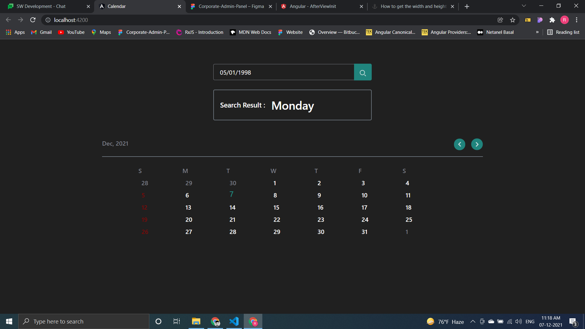
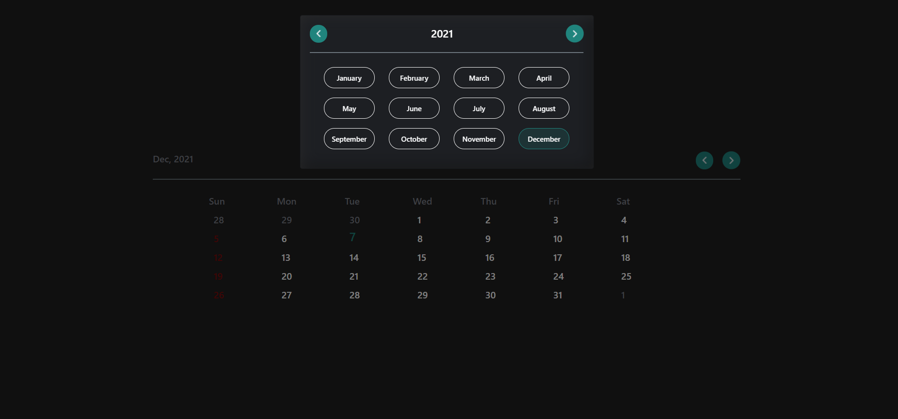
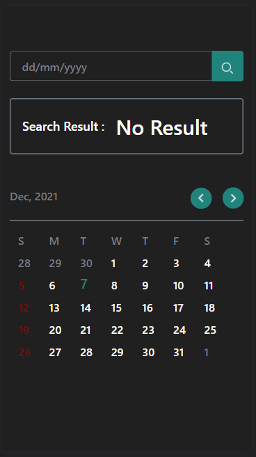
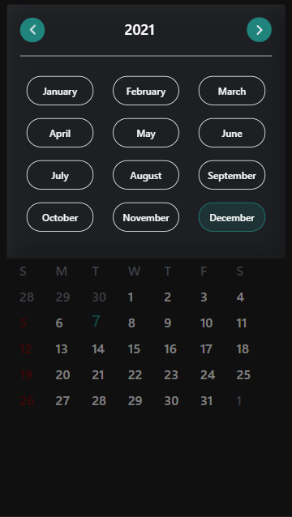

# Calendar

This project was generated with [Angular CLI](https://github.com/angular/angular-cli) version 12.1.1.
This project is a `Custom Calendar`, it is build without any third party libraries and API's,
it contains a search section for searching a day on perticular date , u can simply enter date in formate `dd/mm/yyyy` and get result as a day name
### Search section View

 

###  Desktop View 
full calendar view in desktop. 

 

### Desktop View with pop
it is showing the popup for selecting `month` and `year`

 

### Mobile view 
it is fully responsive with all desktop platforms and mobile devices

 

### Mobile View with pop
it is showing the popup for selecting `month` and `year`

 

